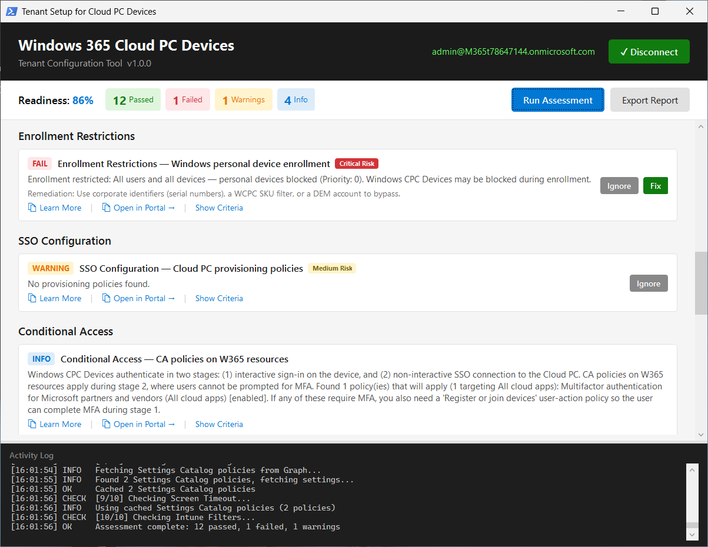
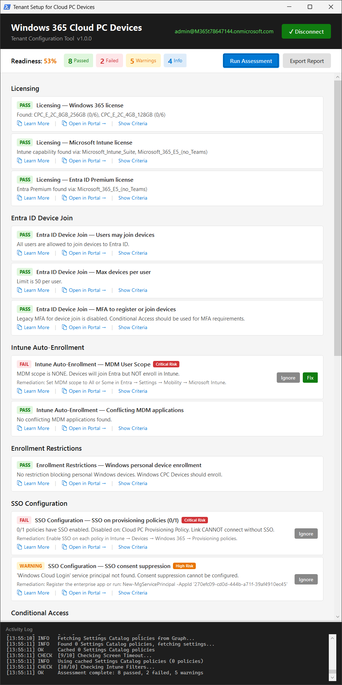
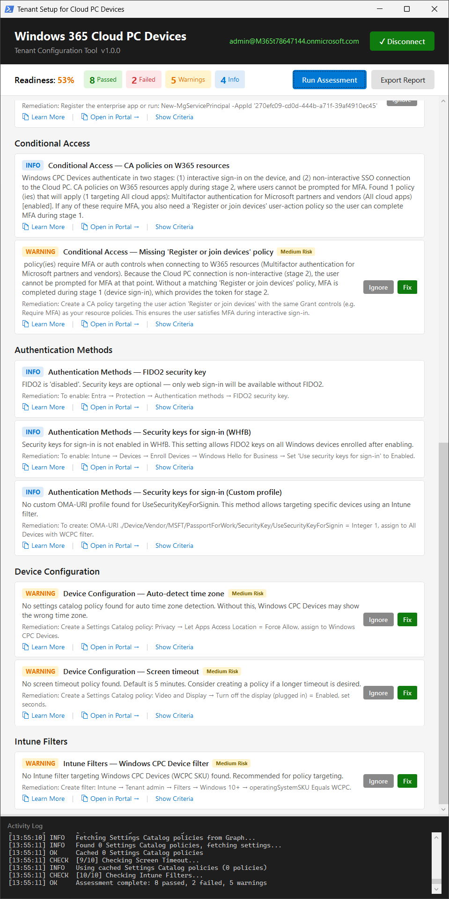

# Tenant Setup for Cloud PC Devices

A WPF dashboard tool that assesses and configures a Microsoft 365 tenant for deployment of **Windows Cloud PC Devices** like [Windows 365 Link](https://learn.microsoft.com/en-us/windows-365/link/overview). Designed for admins setting up lab and demo environments.

> ⚠️ **Community Tool** — This is an unsupported side project. Use at your own risk and test thoroughly before production use.

## What It Does

Windows CPC Devices (Windows 365 Link) require specific Entra ID, Intune, and Windows 365 settings to work properly. This tool automates the checks described in the [official deployment guidance](https://learn.microsoft.com/en-us/windows-365/link/deployment-overview), explains what each setting means, and lets you fix issues with guided dialogs — no portal-hopping required.

### Assessment (10 Check Categories)

| # | Category | What It Checks |
|---|----------|----------------|
| 1 | **Licensing** | Windows 365, Intune, and Entra ID Premium license SKUs |
| 2 | **Entra ID Device Join** | Device join scope (All/Selected/None), max device limit, legacy MFA setting |
| 3 | **Intune Auto-Enrollment** | MDM user scope, conflicting MDM applications |
| 4 | **Enrollment Restrictions** | Platform restrictions blocking personal/Windows enrollment, priority-aware Allow/Block detection |
| 5 | **Cloud PC SSO** | SSO enabled on provisioning policies, SSO consent suppression configured |
| 6 | **Conditional Access** | Policies on W365/AVD/All cloud apps, "Register or join devices" user-action policy, unsupported controls detection, two-stage auth model guidance |
| 7 | **Authentication Methods** | FIDO2 auth method, Windows Hello for Business security key sign-in, custom OMA-URI profile — with context-aware status (warns only on misconfiguration, not missing optional features) |
| 8 | **Device Configuration** | Auto-detect time zone (Settings Catalog) |
| 9 | **Screen Timeout** | Display timeout policy (Settings Catalog) |
| 10 | **Intune Filters** | WCPC assignment filter for device targeting |

### One-Click Fixes

When issues are found, **Fix** buttons appear with confirmation dialogs that explain exactly what will be changed. Each fix offers options like "Apply", "Open in Portal", or "Cancel".

| Fix | What It Does |
|-----|-------------|
| **Entra Device Join** | Sets device join scope to All (or opens portal) |
| **MDM Auto-Enrollment** | Sets MDM scope to All (or opens portal) |
| **Enrollment Restriction** | Creates an Allow policy for WCPC devices at highest priority |
| **CA User-Action Policy** | Creates "Register or join devices" CA policy in **Report-only** mode |
| **FIDO2 Auth Method** | Enables FIDO2 security keys for all users |
| **WHfB Security Key** | Enables "Use security keys for sign-in" in WHfB enrollment settings |
| **Security Key Profile** | Creates custom OMA-URI profile scoped to WCPC devices via Intune filter |
| **Auto Time Zone** | Creates Settings Catalog policy (Let Apps Access Location = Force Allow) |
| **Screen Timeout** | Creates Settings Catalog policy (Display off after 600 seconds) |
| **Intune Filter** | Creates WCPC assignment filter (`operatingSystemSKU -eq "WCPC"`) |

Fixes that require an Intune filter will automatically check for one and offer to create it first.

### Dashboard Features

- **Filter pills** — Click status counts (Passed/Failed/Warnings/Info) to show/hide checks by status
- **Ignore/Undo** — Mark items as "Ignore" if they don't apply to your environment (excluded from score)
- **Copy links** — Copy Learn More or Portal URLs to clipboard with checkmark confirmation
- **Show Criteria** — View the pass/warning/fail thresholds for each check
- **Portal deep-links** — Jump directly to the relevant Entra/Intune/M365 admin page
- **Disconnect/Reconnect** — Switch tenants without restarting
- **HTML Report Export** — Styled report with scores and findings for documentation

## Screenshots

<a href="img/screenshot.png"></a>

<a href="img/screenshot-1.png"></a> <a href="img/screenshot-2.png"></a>

## Prerequisites

- **Windows PowerShell 5.1** or later (required for WPF)
- **Microsoft Graph PowerShell SDK** — the tool will offer to install it if missing
- An account with admin permissions in the target tenant

### Required Graph Permissions (Delegated)

**Read (assessment):**
- `DeviceManagementServiceConfig.Read.All`
- `DeviceManagementConfiguration.Read.All`
- `Policy.Read.All`
- `Directory.Read.All`
- `CloudPC.Read.All`

**Write (remediation):**
- `DeviceManagementServiceConfig.ReadWrite.All`
- `DeviceManagementConfiguration.ReadWrite.All`
- `Policy.ReadWrite.ConditionalAccess`
- `Policy.ReadWrite.DeviceConfiguration`
- `Policy.ReadWrite.MobilityManagement`
- `Policy.ReadWrite.AuthenticationMethod`
- `Directory.ReadWrite.All`

> **Note:** The tool uses delegated permissions with interactive sign-in. No app registration required.

## Installation

```powershell
git clone https://github.com/shannonfritz/WinCPC-Tenant-Setup.git
cd WinCPC-Tenant-Setup
```

Or just download `Start-WinCPCTenantSetup.ps1` — it's a single self-contained script.

## Usage

```powershell
.\Start-WinCPCTenantSetup.ps1
```

### Step-by-Step

1. **Connect** — Click "Connect to Tenant" and sign in with admin credentials
2. **Assess** — Click "Run Assessment" to check all 10 categories
3. **Review** — See color-coded results with Pass/Fail/Warning/Info indicators
4. **Fix** — Click individual "Fix" buttons for guided remediation dialogs
5. **Ignore** — Click "Ignore" on items that don't apply to your environment
6. **Export** — Click "Export Report" to save a styled HTML report
7. **Disconnect** — Click "✓ Disconnect" to switch to a different tenant

## Architecture

Single-file PowerShell script (`Start-WinCPCTenantSetup.ps1`) containing:

- **41 functions** — 15 check functions, 10 fix functions, helpers, and GUI
- **~20 individual check results** across 10 categories
- **Custom WPF dialogs** with labeled buttons for each fix action
- **Policy caching** to minimize Graph API calls during a single assessment
- **Graph API pagination** support for large tenants
- **Per-monitor DPI awareness** and ClearType rendering for crisp text

## Credits

- Assessment logic inspired by [Andrew Willows' W365Link-Deployment-Readiness](https://github.com/awillows/W365Link-Deployment-Readiness)
- UX patterns from [CloudPC-Replace](https://github.com/shannonfritz/CloudPC-Replace)
- Deployment guidance from [Microsoft Learn](https://learn.microsoft.com/en-us/windows-365/link/deployment-overview)

## License

MIT
